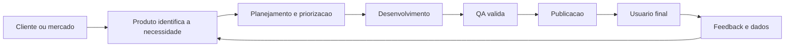
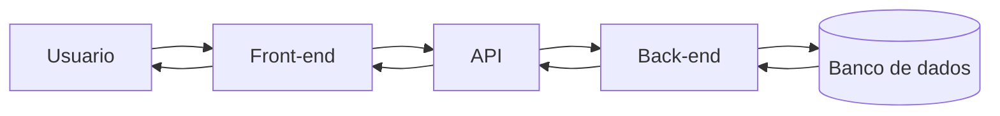
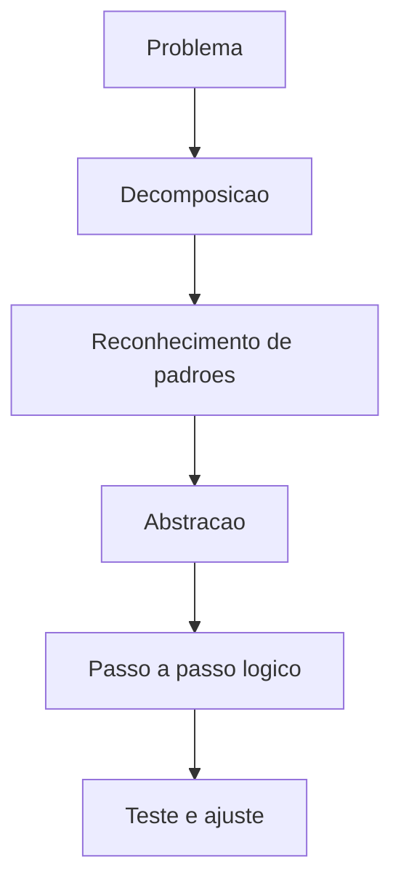
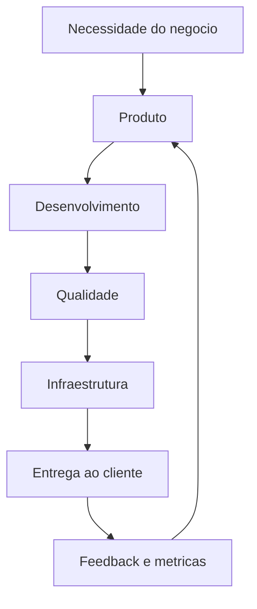

# Módulo 1 — Fundamentos da Tecnologia

## DTEM Treinamentos — Formação Inicial para Carreira em Tecnologia

### A base que transforma curiosidade em visão de mercado

> "Antes de escolher uma área, é preciso entender o jogo inteiro."

---

## Capa

**Curso:** Formação Inicial para Carreira em Tecnologia  
**Módulo:** 1 — Fundamentos da Tecnologia  
**Público-alvo:** Iniciantes e pessoas em transição de carreira  
**Objetivo central:** construir a base de entendimento sobre mercado, times, sistemas e conceitos técnicos essenciais para começar bem na área tech.

---

## Apresentação

Este e-book foi criado para quem está dando os primeiros passos na tecnologia e precisa entender, com clareza, como esse mercado funciona na prática. O objetivo não é transformar você em especialista em um único dia, mas sim te dar repertório para enxergar a lógica por trás das empresas, dos sistemas e das profissões que existem nesse setor.

Ao longo deste módulo, você vai aprender o que é tecnologia no contexto de negócios, quais são as principais áreas de atuação, como uma empresa de tecnologia se organiza e como conceitos como front-end, back-end, APIs, banco de dados e pensamento computacional aparecem no dia a dia.

Este material foi escrito para servir em quatro frentes ao mesmo tempo:

- apoio para o professor ministrar aula com clareza;
- material de acompanhamento para o aluno durante a aula;
- revisão prática depois do encontro;
- base de construção de portfólio e preparação para o mercado.

---

## Objetivo do Módulo

Dar base para quem nunca teve contato com a área de tecnologia, conectando teoria, mercado e prática desde o primeiro momento.

Ao final deste módulo, o aluno deve conseguir:

- explicar o que é tecnologia no contexto de empresas e produtos digitais;
- identificar as principais áreas de atuação em TI;
- entender como times de tecnologia trabalham em conjunto;
- diferenciar front-end, back-end, APIs e banco de dados;
- aplicar noções iniciais de pensamento computacional para resolver problemas.

---

## O Que o Aluno Aprenderá

- Como funciona o mercado de tecnologia e por que ele não se resume a programação.
- Quais são as áreas mais comuns em uma empresa tech e o que cada uma faz.
- Como uma ideia de negócio vira um sistema usado por clientes reais.
- Qual a diferença entre front-end, back-end, API e banco de dados.
- Como pensar de forma lógica e estruturada para resolver problemas.
- Como esse conhecimento aparece em vagas e ajuda na construção da carreira.

---

## Visão Geral do Tema

Fundamentos da tecnologia são os conceitos que ajudam a entender o ecossistema tech antes de aprofundar em uma profissão específica. Sem essa base, o iniciante tende a decorar nomes e ferramentas sem compreender como tudo se conecta.

Em empresas reais, um produto digital não nasce pronto. Existe uma necessidade de negócio, um time que transforma essa necessidade em solução, profissionais com papéis diferentes, processos para garantir qualidade e sistemas que precisam se comunicar entre si.

Este módulo é importante porque:

- reduz a sensação de confusão comum em quem está começando;
- ajuda o aluno a falar a linguagem básica do mercado;
- acelera o entendimento dos próximos módulos;
- permite uma escolha de carreira mais consciente.

---

## Tópico 1 — O Que É Tecnologia e Como Funciona o Mercado de TI

### Conceito

Tecnologia, no contexto deste curso, é o uso de conhecimento, processos, sistemas e ferramentas para resolver problemas de pessoas, empresas e operações.

### Explicação simples

Tecnologia não é só "mexer com computador". É criar soluções para facilitar tarefas, melhorar processos, vender melhor, atender clientes, automatizar rotinas e tomar decisões com mais rapidez.

### Explicação técnica

No mercado, tecnologia envolve a construção, manutenção e evolução de produtos e serviços digitais. Isso inclui software, infraestrutura, dados, segurança, testes, processos ágeis, experiência do usuário e integração entre áreas de negócio e times técnicos.

### Exemplo do mundo real

Quando você pede comida em um aplicativo, existe tecnologia em várias camadas:

- a tela que você usa no celular;
- a lógica que calcula entrega e pagamento;
- o banco de dados que guarda pedido e endereço;
- os testes que evitam erros;
- os dashboards que ajudam o negócio a tomar decisões.

### Exemplo dentro de uma empresa

Imagine uma fintech que quer reduzir abandono no cadastro. O time de Produto identifica o problema, Desenvolvimento ajusta o fluxo, QA valida os cenários, Dados mede a conversão e Gestão acompanha o impacto no negócio.

### Erros comuns de iniciantes

- achar que tecnologia é sinônimo de programação;
- acreditar que só existe espaço para quem sabe desenvolver;
- pensar que todas as empresas tech trabalham do mesmo jeito;
- focar só em ferramenta e ignorar processo e negócio.

### Boas práticas

- enxergar tecnologia como resolução de problema;
- aprender o básico do funcionamento de times e sistemas;
- observar como negócio e tecnologia se conectam;
- desenvolver vocabulário técnico desde o início.

### Como isso aparece em vagas

É comum encontrar termos como:

- ambiente dinâmico;
- produto digital;
- visão de negócio;
- atuação em time multidisciplinar;
- entendimento do ciclo de desenvolvimento.

### Como isso ajuda na carreira

Quem entende o mercado mais cedo consegue:

- escolher melhor sua trilha profissional;
- se comunicar com mais confiança em entrevistas;
- entender o contexto das ferramentas que vai aprender depois;
- construir repertório para crescer mais rápido.

### Exercício prático

Escreva, com suas palavras, uma definição simples de tecnologia aplicada a negócios. Depois, cite três situações do seu dia a dia em que a tecnologia resolve um problema real.

---

## Tópico 2 — Principais Áreas da Tecnologia

### Conceito

Uma empresa de tecnologia funciona com várias áreas especializadas que colaboram para construir, testar, lançar e melhorar produtos digitais.

### Explicação simples

Nem todo profissional de tecnologia programa, e nem todo programador faz o mesmo tipo de trabalho. Existem pessoas focadas em qualidade, produto, infraestrutura, dados, gestão e desenvolvimento.

### Explicação técnica

As áreas mais comuns em empresas tech são organizadas por especialidade e responsabilidade operacional. Embora cada empresa tenha sua própria estrutura, o mais comum é haver integração entre Produto, Engenharia, Qualidade, Dados, Infraestrutura e Gestão.

### Visão rápida das áreas

| Área | Foco principal | Exemplo de responsabilidade |
|---|---|---|
| Desenvolvimento | Construir funcionalidades | Implementar tela, regra de negócio e integração |
| QA | Garantir qualidade | Testar fluxos, validar correções e reportar bugs |
| Produto | Entender problema e priorizar solução | Criar requisitos, histórias e critérios de aceite |
| Dados | Medir e gerar inteligência | Analisar métricas e apoiar decisões |
| Infraestrutura | Sustentar ambiente e entrega | Hospedagem, deploy, monitoramento e estabilidade |
| Gestão | Organizar pessoas, prazo e fluxo | Acompanhar sprint, riscos e entregas |

### Exemplo do mundo real

Em um e-commerce, Produto define a prioridade de um novo checkout, Desenvolvimento implementa a funcionalidade, QA valida pagamento e carrinho, Dados acompanha conversão e Infra garante que a aplicação aguente alto volume de acessos.

### Exemplo dentro de uma empresa

Em uma squad de marketplace:

- o PO prioriza melhorias para reduzir abandono de compra;
- o time Dev implementa ajustes na jornada;
- o QA testa diferentes combinações de carrinho;
- o analista de dados verifica se a taxa de conversão subiu;
- a Infra monitora performance no horário de pico.

### Erros comuns de iniciantes

- imaginar que todas as áreas fazem a mesma coisa;
- escolher uma trilha por modismo, e não por perfil;
- subestimar áreas não técnicas no ecossistema digital;
- achar que uma área é "mais importante" que outra.

### Boas práticas

- estudar o papel de cada área antes de decidir uma carreira;
- observar onde seu perfil se encaixa melhor;
- entender que colaboração é parte central do trabalho;
- aprender a linguagem básica das áreas vizinhas.

### Como isso aparece em vagas

As descrições de vaga costumam mencionar:

- trabalho em squad;
- interface com áreas parceiras;
- comunicação com time técnico;
- foco em qualidade, entrega ou negócio;
- capacidade analítica e organização.

### Como isso ajuda na carreira

Esse entendimento evita escolhas cegas e ajuda o aluno a:

- se posicionar melhor no currículo e no LinkedIn;
- entender trajetórias possíveis;
- conversar com recrutadores com mais maturidade;
- migrar de área com menos ruído no futuro.

### Exercício prático

Monte uma tabela simples com as áreas `Desenvolvimento`, `QA`, `Produto`, `Dados`, `Infraestrutura` e `Gestão`. Em cada uma, escreva:

- o que a área entrega;
- qual habilidade parece mais importante;
- qual ponto mais chamou sua atenção.

---

## Tópico 3 — Como Funciona Uma Empresa de Tecnologia

### Conceito

Uma empresa de tecnologia organiza pessoas, processos e ferramentas para transformar necessidades de negócio em soluções digitais de valor para o cliente.

### Explicação simples

Uma empresa tech não funciona como um grupo de pessoas "fazendo código". Ela trabalha como um sistema: alguém entende o problema, alguém planeja a solução, alguém desenvolve, alguém valida, alguém publica e todos acompanham o resultado.

### Explicação técnica

Empresas de tecnologia operam por meio de fluxos colaborativos. A estrutura pode variar entre startups, fintechs, software houses e grandes empresas, mas geralmente existe uma combinação de:

- objetivos de negócio;
- priorização de backlog;
- desenvolvimento iterativo;
- testes;
- deploy;
- monitoramento;
- melhoria contínua.

### Exemplo do mundo real

Uma plataforma de delivery percebe aumento de reclamações no rastreio de pedidos. O problema é analisado, transformado em requisito, desenvolvido em pequenas entregas, testado em ambiente controlado e liberado para produção com monitoramento.

### Exemplo dentro de uma empresa

Em uma empresa SaaS que vende sistema para clínicas:

- Comercial identifica uma dor recorrente dos clientes;
- Produto refina a necessidade;
- Desenvolvimento estima a solução;
- QA planeja testes;
- Gestão acompanha prazo e risco;
- suporte coleta feedback após a entrega.

### Erros comuns de iniciantes

- achar que a entrega termina quando o código fica pronto;
- ignorar etapas como validação, homologação e acompanhamento;
- não entender que tecnologia serve ao negócio;
- pensar que cada time trabalha isolado.

### Boas práticas

- entender o fluxo do início ao fim;
- valorizar documentação e comunicação;
- observar dependências entre áreas;
- acompanhar impacto da entrega depois da publicação.

### Como isso aparece em vagas

Muitas vagas pedem:

- entendimento de ciclo de vida de software;
- experiência com times ágeis;
- capacidade de atuar em equipe multidisciplinar;
- visão de produto e foco em cliente.

### Como isso ajuda na carreira

Quando o aluno entende como a empresa funciona, ele aprende mais rápido no trabalho real, evita interpretações rasas e consegue contribuir com mais contexto, mesmo em posições juniores.

### Exercício prático

Desenhe, em papel ou ferramenta digital, o fluxo abaixo com suas palavras:

`problema de negócio -> priorização -> desenvolvimento -> teste -> entrega -> feedback`

Depois, explique o que pode dar errado em cada etapa.

---

## Tópico 4 — Front-end vs Back-end

### Conceito

Front-end é a parte do sistema com a qual o usuário interage diretamente. Back-end é a parte responsável por processar regras, dados e integrações nos bastidores.

### Explicação simples

Se um sistema fosse um restaurante:

- o front-end seria o salão, o cardápio e a experiência do cliente;
- o back-end seria a cozinha, os processos, os pedidos e o controle interno.

### Explicação técnica

Front-end envolve interface, experiência do usuário, navegação, componentes visuais e consumo de dados. Back-end envolve autenticação, regras de negócio, APIs, integração com banco de dados, processamento e segurança de informações.

### Exemplo do mundo real

Em um aplicativo bancário:

- o front-end mostra saldo, extrato e botões de transferência;
- o back-end valida login, consulta saldos, verifica limites e registra transações.

### Exemplo dentro de uma empresa

Uma empresa de educação cria uma tela de matrícula online:

- front-end organiza formulário, mensagens e usabilidade;
- back-end valida campos, salva cadastro, dispara e-mail e registra pagamento.

### Erros comuns de iniciantes

- achar que front-end é só "deixar bonito";
- achar que back-end é apenas banco de dados;
- não perceber que as duas camadas dependem uma da outra;
- ignorar experiência do usuário ou segurança.

### Boas práticas

- entender o fluxo completo entre interface e processamento;
- usar linguagem de negócio para explicar a função de cada lado;
- observar performance, clareza e consistência;
- lembrar que front-end e back-end são complementares.

### Como isso aparece em vagas

Vagas costumam mencionar:

- integração com APIs;
- consumo de serviços;
- regras de negócio;
- experiência do usuário;
- arquitetura de aplicações.

### Como isso ajuda na carreira

Mesmo quem não pretende programar se beneficia ao entender a conversa entre interface e lógica. Isso ajuda em QA, Produto, Gestão e análise de requisitos.

### Exercício prático

Escolha um aplicativo que você usa com frequência. Liste cinco elementos visíveis ao usuário e cinco coisas que provavelmente acontecem no back-end para que aquela funcionalidade funcione.

---

## Tópico 5 — APIs

### Conceito

API é uma forma padronizada de comunicação entre sistemas, serviços ou partes de um sistema.

### Explicação simples

API é como um garçom entre você e a cozinha. Você faz um pedido, o garçom leva até quem executa, volta com a resposta e mantém a organização da comunicação.

### Explicação técnica

Em software, APIs permitem troca de dados entre aplicações. Elas definem rotas, formatos de entrada e saída, métodos de requisição e regras de autenticação. São fundamentais para integração entre front-end, back-end, sistemas terceiros e serviços internos.

### Exemplo do mundo real

Quando um aplicativo consulta o CEP digitado pelo usuário e preenche rua, bairro e cidade automaticamente, ele provavelmente está usando uma API para buscar esses dados.

### Exemplo dentro de uma empresa

Em um marketplace, o sistema pode usar:

- uma API para processar pagamento;
- outra para calcular frete;
- outra para enviar notificação por e-mail ou SMS.

### Erros comuns de iniciantes

- pensar que API é uma tela;
- confundir API com banco de dados;
- acreditar que integração é "automática" sem regras;
- ignorar que APIs podem falhar e precisam ser testadas.

### Boas práticas

- entender entrada, processamento e saída;
- observar status de resposta e mensagens de erro;
- documentar regras de uso;
- testar cenários positivos e negativos.

### Como isso aparece em vagas

É muito comum ver termos como:

- consumo de API;
- integração entre sistemas;
- validação de payload;
- testes de serviços;
- documentação de endpoints.

### Como isso ajuda na carreira

APIs aparecem em Desenvolvimento, QA, Produto, Dados e até em áreas de negócio. Entender esse conceito faz o aluno evoluir mais rápido em quase qualquer função da área tech.

### Exercício prático

Pense em um aplicativo de compras. Escreva três exemplos de APIs que ele pode usar e diga qual problema cada uma resolve.

---

## Tópico 6 — Banco de Dados

### Conceito

Banco de dados é o local onde as informações de um sistema são organizadas, armazenadas e consultadas.

### Explicação simples

Se um sistema fosse uma empresa física, o banco de dados seria o arquivo central onde ficam cadastros, histórico, transações e registros importantes.

### Explicação técnica

Bancos de dados armazenam dados estruturados ou não estruturados e permitem operações de inserção, consulta, atualização e exclusão. Em sistemas digitais, são essenciais para persistência de informação, rastreabilidade e funcionamento de regras de negócio.

### Exemplo do mundo real

Quando você faz login em um aplicativo, o sistema precisa consultar alguma fonte de dados para verificar seu cadastro, permissões e informações relacionadas à conta.

### Exemplo dentro de uma empresa

Em uma plataforma de cursos:

- alunos são cadastrados no banco de dados;
- aulas concluídas ficam registradas;
- pagamentos precisam ser associados ao usuário correto;
- relatórios dependem da integridade dessas informações.

### Erros comuns de iniciantes

- achar que o banco de dados "faz tudo sozinho";
- não perceber a importância da qualidade dos dados;
- confundir banco de dados com API;
- ignorar impactos de cadastro inconsistente.

### Boas práticas

- pensar em organização e consistência dos dados;
- entender que dado ruim gera decisão ruim;
- validar entradas para evitar sujeira na base;
- lembrar que segurança e privacidade importam.

### Como isso aparece em vagas

Mesmo em vagas não técnicas, aparecem termos como:

- consulta de dados;
- integridade de informação;
- análise de registros;
- entendimento de base de usuários;
- rastreabilidade.

### Como isso ajuda na carreira

Entender banco de dados ajuda o aluno a interpretar bugs, requisitos, fluxos de cadastro, relatórios e métricas com muito mais clareza.

### Exercício prático

Liste quais dados um sistema de agendamento médico precisaria armazenar para funcionar corretamente. Depois, diga quais problemas aconteceriam se essas informações fossem salvas de forma errada.

---

## Tópico 7 — Introdução ao Pensamento Computacional

### Conceito

Pensamento computacional é a habilidade de resolver problemas de forma lógica, estruturada e repetível.

### Explicação simples

É a capacidade de pegar um problema grande, quebrar em partes menores, identificar padrões, focar no que importa e montar um passo a passo claro para chegar à solução.

### Explicação técnica

Pensamento computacional costuma ser explicado por quatro pilares:

- decomposição;
- reconhecimento de padrões;
- abstração;
- algoritmos.

Esses pilares ajudam na criação de soluções lógicas, seja em código, teste, análise, produto ou gestão.

### Exemplo do mundo real

Se uma pessoa quer organizar sua rotina de estudos, ela pode dividir matérias, identificar horários disponíveis, priorizar o essencial e criar uma sequência de ações. Isso já é pensamento computacional aplicado fora da programação.

### Exemplo dentro de uma empresa

Um QA recebe a reclamação "o sistema está com problema". Em vez de testar tudo de forma aleatória, ele quebra o cenário em partes:

- em qual tela ocorreu;
- com qual perfil;
- em qual etapa;
- o que era esperado;
- o que aconteceu de fato.

Essa estrutura acelera a investigação.

### Erros comuns de iniciantes

- tentar resolver tudo de uma vez;
- pular etapas de entendimento do problema;
- confundir rapidez com clareza;
- não registrar o raciocínio.

### Boas práticas

- quebrar problemas grandes em partes menores;
- testar hipóteses de forma organizada;
- registrar entrada, ação e resultado;
- revisar o processo para melhorar a solução.

### Como isso aparece em vagas

Muitas vagas pedem indiretamente pensamento computacional por meio de requisitos como:

- raciocínio lógico;
- análise crítica;
- resolução de problemas;
- organização;
- atenção a detalhes.

### Como isso ajuda na carreira

Essa habilidade é valiosa em qualquer trilha da tecnologia. Ela melhora investigação de bugs, escrita de requisitos, análise de processos, tomada de decisão e comunicação técnica.

### Exercício prático

Escolha um problema simples do seu dia a dia, como organizar tarefas da semana. Resolva usando os quatro passos:

1. decomposição;
2. reconhecimento de padrões;
3. abstração;
4. sequência lógica de execução.

---

## Exemplos Reais do Mercado

### Caso 1 — Banco digital

Em um banco digital, uma nova funcionalidade de cartão virtual pode envolver:

- Produto definindo a dor do cliente;
- Desenvolvimento criando a funcionalidade;
- QA validando regras de segurança;
- Dados medindo uso;
- Infra garantindo estabilidade e disponibilidade.

### Caso 2 — E-commerce

Em um e-commerce, a simples atualização de um botão de compra pode impactar:

- experiência do usuário no front-end;
- cálculo de estoque e pedido no back-end;
- integração com API de pagamento;
- registro no banco de dados;
- indicadores de conversão acompanhados pelo time.

### Caso 3 — Plataforma de educação

Em uma edtech, o processo de login e matrícula passa por vários fundamentos deste módulo:

- front-end para exibir telas e formulários;
- back-end para autenticar e processar regras;
- API para comunicação entre serviços;
- banco de dados para guardar alunos e cursos;
- pensamento computacional para desenhar fluxos claros e testáveis.

---

## Cenários do Dia a Dia em Empresas Tech

### Cenário 1 — Reunião de alinhamento entre áreas

O time percebe queda no uso do aplicativo. Produto levanta hipóteses, Dados mostra os números, QA relata problemas encontrados, Desenvolvimento analisa viabilidade técnica e Gestão organiza a priorização.

**Aprendizado:** tecnologia funciona por colaboração, não por atuação isolada.

### Cenário 2 — Bug em produção

Usuários não conseguem finalizar cadastro. O front-end exibe mensagem genérica, o back-end retorna erro de validação, o QA reproduz o problema, Infra verifica logs e Produto decide se a correção entra como prioridade máxima.

**Aprendizado:** entender o fluxo do sistema reduz tempo de resposta.

### Cenário 3 — Lançamento de nova funcionalidade

A empresa quer lançar agendamento online. Para isso, precisa de:

- tela amigável;
- regras de disponibilidade;
- comunicação com API de confirmação;
- dados armazenados corretamente;
- testes antes do deploy.

**Aprendizado:** cada conceito deste módulo participa da entrega final.

---

## Tabelas Comparativas

### Front-end vs Back-end

| Critério | Front-end | Back-end |
|---|---|---|
| O que é | Parte visível do sistema | Parte lógica e processadora |
| Foco | Interface e experiência | Regras, dados e integrações |
| Exemplo | Tela de login | Validação do login |
| Quem usa mais diretamente | Usuário final | Sistemas e serviços internos |
| Impacto de falha | Tela quebrada ou confusa | Regra errada, erro de processamento |

### API vs Banco de Dados

| Conceito | API | Banco de dados |
|---|---|---|
| Função principal | Comunicar sistemas | Armazenar informações |
| Exemplo | Consultar CEP | Guardar cadastro de usuários |
| Tipo de problema que resolve | Integração | Persistência de dados |
| Quem consome | Aplicações e serviços | Sistemas, serviços e relatórios |

### Áreas da Tecnologia

| Área | Pergunta que costuma responder |
|---|---|
| Produto | O que devemos construir e por quê? |
| Desenvolvimento | Como vamos construir? |
| QA | Isso funciona corretamente? |
| Dados | O que os números estão mostrando? |
| Infraestrutura | O sistema está estável e disponível? |
| Gestão | Como organizamos pessoas, fluxo e entrega? |

---

## Diagramas Mermaid

### Fluxo básico de uma empresa de tecnologia

### Relação entre front-end, back-end, API e banco de dados

### Pensamento computacional na prática

### Colaboração entre áreas em uma squad

---

## Glossário

| Termo | Significado |
|---|---|
| Tecnologia | Uso de conhecimento e ferramentas para resolver problemas |
| TI | Tecnologia da Informação |
| Front-end | Parte visual e interativa de um sistema |
| Back-end | Parte lógica que processa dados e regras |
| API | Interface que permite comunicação entre sistemas |
| Banco de dados | Estrutura de armazenamento de informações |
| Deploy | Publicação de uma nova versão do sistema |
| Squad | Time multidisciplinar focado em uma entrega ou produto |
| Requisito | Necessidade que o sistema deve atender |
| Bug | Erro ou comportamento incorreto do sistema |
| Pensamento computacional | Forma lógica de analisar e resolver problemas |
| Priorização | Definição do que deve ser feito primeiro |

---

## Exercícios Práticos

### Exercício 1 — Mapeando tecnologia no cotidiano

**Objetivo:** perceber tecnologia além da programação.  
**Cenário:** você vai observar seu dia a dia digital.  
**Passo a passo:**

1. Liste cinco aplicativos ou sistemas que você usa.
2. Escreva qual problema cada um resolve.
3. Identifique qual área de tecnologia participa desse produto.

**Resultado esperado:** visão mais ampla sobre o papel da tecnologia.

### Exercício 2 — Descobrindo perfis de atuação

**Objetivo:** entender as áreas de TI.  
**Cenário:** você está avaliando qual trilha faz mais sentido para sua carreira.  
**Passo a passo:**

1. Escolha duas áreas da tecnologia.
2. Compare foco, rotina, tipo de entrega e habilidade principal.
3. Escreva em qual delas você se imagina e por quê.

**Resultado esperado:** percepção inicial de afinidade profissional.

### Exercício 3 — Anatomia de um aplicativo

**Objetivo:** diferenciar front-end, back-end, API e banco de dados.  
**Cenário:** você vai analisar um app de compras, banco ou streaming.  
**Passo a passo:**

1. Identifique elementos que o usuário enxerga.
2. Descreva o que precisa acontecer nos bastidores.
3. Cite uma API possível e quais dados precisam ser armazenados.

**Resultado esperado:** entendimento do fluxo básico de um sistema.

### Exercício 4 — Raciocínio estruturado

**Objetivo:** praticar pensamento computacional.  
**Cenário:** organizar o processo de inscrição de um aluno em um curso online.  
**Passo a passo:**

1. Quebre o problema em partes.
2. Identifique passos repetidos.
3. Separe o essencial do acessório.
4. Monte a sequência lógica de execução.

**Resultado esperado:** solução mais clara e organizada.

---

## Mini Desafios

### Mini desafio 1 — Explique como se fosse para um amigo

Explique a diferença entre front-end e back-end sem usar termos técnicos. Seu objetivo é fazer uma pessoa leiga entender em menos de um minuto.

### Mini desafio 2 — Monte sua primeira visão de carreira

Escolha uma área entre `QA`, `Produto`, `Desenvolvimento`, `Dados`, `Infraestrutura` ou `Gestão` e responda:

- por que essa área te chamou atenção;
- quais habilidades você acredita que precisa desenvolver;
- como esse módulo te ajudou a enxergá-la melhor.

### Mini desafio 3 — Simule uma empresa

Imagine que sua empresa vai lançar um aplicativo de agendamento. Escreva quem faria o quê em:

- Produto;
- Desenvolvimento;
- QA;
- Infraestrutura;
- Gestão.

### Mini desafio 4 — Pense como quem resolve problema

Crie um passo a passo lógico para resolver este problema:

`clientes reclamam que não conseguem concluir cadastro no aplicativo`

---

## Entrega Final do Módulo

### Entregável oficial

**Mapa mental das áreas de TI**

### Orientação de execução

O aluno deverá criar um mapa mental com o centro `Áreas da Tecnologia` e ramificações para:

- Desenvolvimento;
- QA;
- Produto;
- Dados;
- Infraestrutura;
- Gestão.

Para cada área, o mapa deve conter:

- objetivo principal;
- exemplo de atividade;
- relação com outras áreas;
- tipo de problema que ajuda a resolver.

### Critérios de avaliação

| Critério | O que observar |
|---|---|
| Clareza | Se o aluno explicou de forma compreensível |
| Organização | Se as áreas estão bem separadas e conectadas |
| Aplicação prática | Se os exemplos fazem sentido para o mercado |
| Visão sistêmica | Se o aluno percebeu que as áreas colaboram |

### Sugestão de ferramenta

- papel e caneta;
- Canva;
- Miro;
- Figma;
- PowerPoint.

---

## Guia do Professor

### Objetivo da aula

Apresentar a base do ecossistema de tecnologia para iniciantes, reduzindo confusão inicial e conectando conceitos fundamentais com situações reais de mercado.

### Tempo sugerido

| Etapa | Tempo sugerido |
|---|---|
| Abertura e contextualização | 15 min |
| O que é tecnologia e mercado de TI | 20 min |
| Áreas da tecnologia | 25 min |
| Como funciona uma empresa tech | 20 min |
| Front-end, back-end, API e banco de dados | 35 min |
| Pensamento computacional | 20 min |
| Exercício em grupo | 20 min |
| Fechamento e entrega final | 15 min |

### Estratégia de condução

- Comece perguntando quais nomes de áreas os alunos já ouviram.
- Mostre que tecnologia é resolução de problema, não apenas código.
- Use exemplos de aplicativos conhecidos para ancorar a explicação.
- Reforce o vocabulário básico várias vezes ao longo da aula.
- Conecte sempre cada conceito a uma situação de empresa real.

### Perguntas para os alunos

- Quando você pensa em tecnologia, o que vem à cabeça?
- Você acredita que toda pessoa de tecnologia precisa programar? Por quê?
- Qual área mais chamou sua atenção até agora?
- O que você acha que acontece quando clica em "Entrar" em um aplicativo?
- Por que uma empresa não pode depender de uma única área para entregar valor?

### Dinâmicas sugeridas

**Dinâmica 1 — Anatomia de um app**

Peça aos alunos que escolham um aplicativo conhecido e identifiquem:

- o que é front-end;
- o que pode estar no back-end;
- quais dados devem ser salvos;
- que integrações podem existir.

**Dinâmica 2 — Squad simulada**

Divida a turma em grupos e atribua papéis:

- Produto;
- QA;
- Dev;
- Infra;
- Gestão.

Dê um cenário simples, como "criar uma funcionalidade de agendamento", e peça que cada grupo explique sua participação.

### Possíveis dúvidas e respostas de apoio

| Dúvida | Explicação de apoio |
|---|---|
| Preciso saber programar para entrar em tecnologia? | Não necessariamente. Existem áreas como QA, Produto e Gestão que podem ser porta de entrada, embora entender lógica e contexto técnico ajude muito. |
| API é a mesma coisa que banco de dados? | Não. API comunica; banco de dados armazena. |
| Front-end é menos técnico que back-end? | Não. São especialidades diferentes com desafios distintos. |
| Pensamento computacional serve só para quem programa? | Não. Ele ajuda qualquer profissional a organizar raciocínio e resolver problemas. |

### Pontos de atenção do professor

- Evitar excesso de siglas sem explicação.
- Não presumir conhecimento prévio do aluno.
- Repetir conceitos-chave com exemplos diferentes.
- Estimular perguntas sem ridicularizar dúvidas básicas.
- Observar se a turma entendeu relação entre áreas, e não apenas definições isoladas.

---

## Resumo Final Para o Aluno

Neste módulo, você construiu a base que sustenta toda a jornada na tecnologia. Você viu que:

- tecnologia é resolução de problema com apoio de processos, sistemas e pessoas;
- o mercado de TI tem várias áreas, e não apenas desenvolvimento;
- empresas tech funcionam por colaboração entre times;
- front-end, back-end, API e banco de dados têm papéis diferentes, mas conectados;
- pensamento computacional ajuda a resolver problemas com lógica e clareza.

Mais importante do que decorar termos é começar a enxergar o cenário completo. Quando você entende como as peças se conectam, aprende com mais velocidade, faz perguntas melhores e se posiciona com mais maturidade no mercado.

O próximo passo é usar essa base para desenvolver raciocínio lógico com mais profundidade, o que será essencial para qualquer trilha que você escolher dentro da tecnologia.

---

## Fechamento

Se você chegou até aqui, já deu um passo importante: saiu da visão superficial sobre tecnologia e começou a construir visão de mercado. Esse é o tipo de base que diferencia quem apenas consome conteúdo de quem começa a se preparar de verdade para atuar na área.
