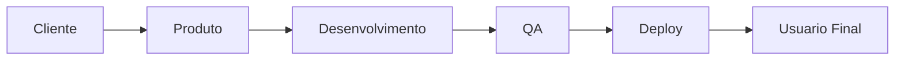
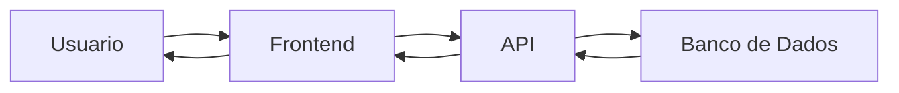
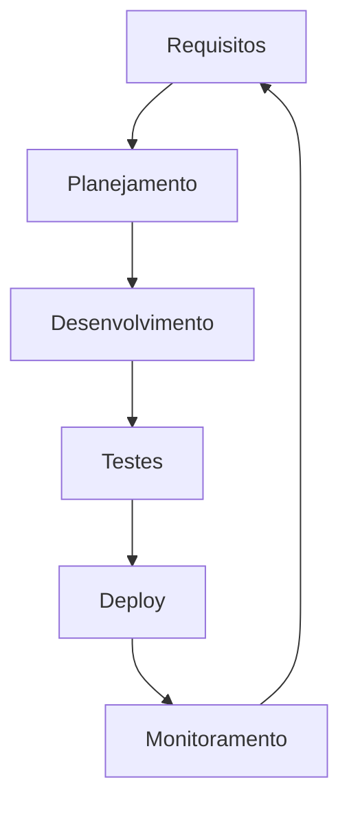
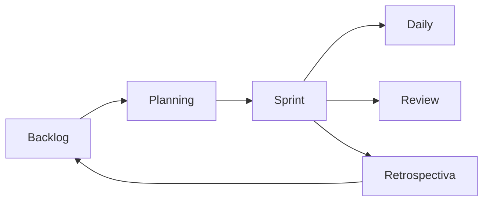
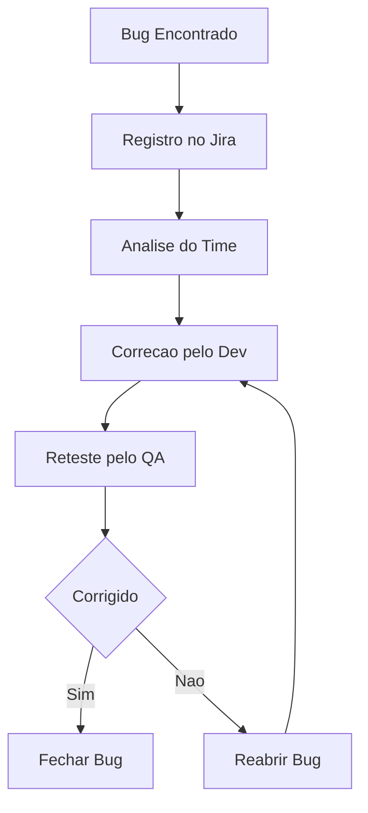
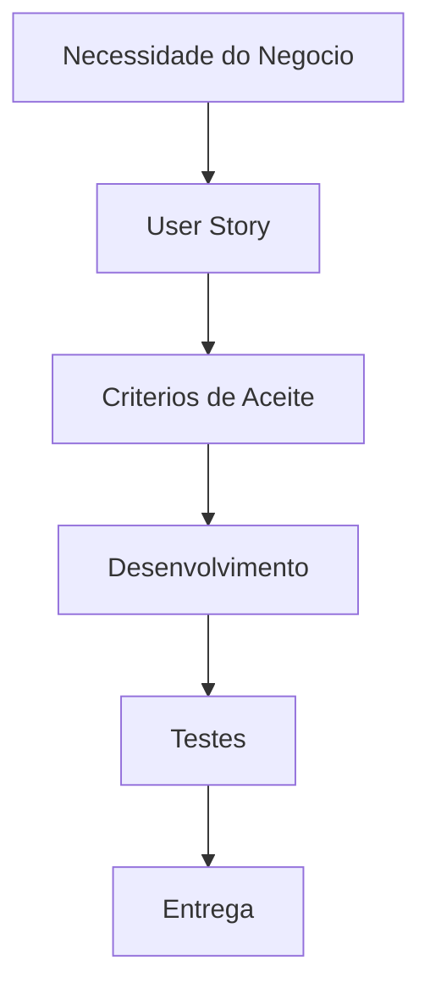

# 🚀 [NOME DO MÓDULO]

## DTEM TREINAMENTOS — Formação Inicial para Carreira em Tecnologia

### [SUBTÍTULO IMPACTANTE]

> "Frase motivacional sobre tecnologia, carreira e evolução profissional."

---

# 📚 APRESENTAÇÃO

## 🎯 Objetivo do módulo

[Explicar o objetivo principal do módulo.]

---

## 🧠 O que o aluno aprenderá

- Item 1
- Item 2
- Item 3
- Item 4

---

## 💼 Como isso aparece no mercado

[Explicar como esse conhecimento é utilizado em empresas reais.]

---

# 🌎 VISÃO GERAL DO TEMA

## O que é [TEMA]

[Explicação simples e acessível.]

---

## Por que isso é importante

[Importância dentro do mercado tech.]

---

## Como empresas utilizam isso

[Exemplo corporativo.]

---

# 🧩 TÓPICO 1 — [NOME DO TÓPICO]

## 📖 Conceito

---

## 🧠 Explicação simples

---

## ⚙️ Explicação técnica

---

## 🏢 Exemplo real do mercado

---

## 💼 Cenário empresarial

Exemplo:

> Imagine que você trabalha em uma empresa como Nubank, iFood ou Mercado Livre...

---

## 🔥 Como isso funciona no dia a dia

---

## ❌ Erros comuns de iniciantes

- Erro 1
- Erro 2
- Erro 3

---

## ✅ Boas práticas

- Boa prática 1
- Boa prática 2

---

## 💡 Dicas profissionais

---

## 🛠️ Ferramentas utilizadas no mercado

| Ferramenta | Objetivo | Onde é usada |
|---|---|---|
| Jira | Gestão | Times ágeis |

---

## 📌 Glossário técnico

| Termo | Significado |
|---|---|
| API | Interface de comunicação |

---

# 🧠 COMO ISSO FUNCIONA EM UMA EMPRESA REAL

## Fluxo corporativo

## Fluxo de sistema

## Fluxo SDLC

## Fluxo Scrum

## Fluxo de Bug

## Fluxo de User Story

Comunicação entre times
Impacto no negócio
O que acontece quando isso é feito errado
📊 TABELA COMPARATIVA
Conceito	Cenário correto	Cenário incorreto
QA	Valida antes do deploy	Sistema quebra em produção
🧪 EXERCÍCIOS PRÁTICOS
Exercício 1
Objetivo
Cenário
Passo a passo
Resultado esperado
🔥 MINI DESAFIO
💼 COMO ISSO AJUDA SUA CARREIRA
Cargos relacionados
QA
PO
Dev
Scrum Master
Como colocar no currículo
Como colocar no LinkedIn
Como isso aparece em vagas
🧠 RESUMO DO MÓDULO
👨‍🏫 GUIA DO PROFESSOR
Objetivo da aula
Tempo sugerido
Etapa	Tempo
Introdução	15 min
Perguntas para os alunos
Pergunta 1
Pergunta 2
Dinâmicas sugeridas
Possíveis dúvidas
Dúvida	Explicação
O que é API?	Explicação
📌 ENTREGA FINAL
🚀 PRÓXIMOS PASSOS
📚 MATERIAL COMPLEMENTAR
🔗 REFERÊNCIAS