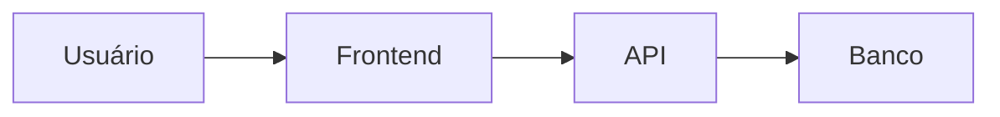
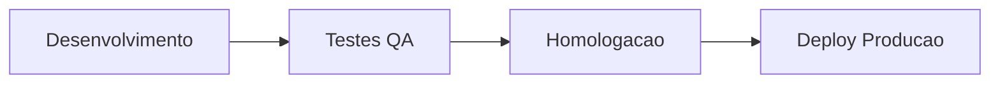

# 🚀 PROJETO FINAL — [NOME DO PROJETO]

---

# 🏢 EMPRESA FICTÍCIA

---

# 🎯 OBJETIVO DO SISTEMA

---

# 🌎 CONTEXTO DE NEGÓCIO

---

# 🚨 PROBLEMA A SER RESOLVIDO

---

# 👥 PERSONAS

| Persona | Objetivo |
|---|---|
| Cliente | Agendar consulta |

---

# 📋 REQUISITOS FUNCIONAIS

- RF001
- RF002

---

# ⚙️ REQUISITOS NÃO FUNCIONAIS

- Performance
- Segurança

---

# 🔄 FLUXO DO SISTEMA

# 🧠 USER STORIES

---

## US001 — Login na Plataforma

### Como
usuário da plataforma

### Quero
realizar login utilizando e-mail e senha

### Para
acessar minhas funcionalidades e informações pessoais

---

## 🎯 Critérios de aceite

- O sistema deve permitir login com e-mail e senha válidos
- O sistema deve exibir mensagem de erro para credenciais inválidas
- O sistema deve redirecionar o usuário para a dashboard após login
- O sistema deve bloquear acesso sem autenticação
- O sistema deve possuir opção "Esqueci minha senha"

---

## US002 — Cadastro de Usuário

### Como
novo usuário

### Quero
criar uma conta na plataforma

### Para
utilizar os serviços do sistema

---

## 🎯 Critérios de aceite

- O sistema deve validar e-mail único
- O sistema deve validar senha mínima
- O sistema deve salvar usuário no banco
- O sistema deve enviar confirmação de cadastro

---

# 📊 BACKLOG

| ID | Item | Prioridade | Responsável | Status |
|---|---|---|---|---|
| 1 | Tela de login | Alta | Dev Frontend | Em andamento |
| 2 | API de autenticação | Alta | Dev Backend | Em andamento |
| 3 | Recuperação de senha | Média | Backend | Pendente |
| 4 | Dashboard inicial | Média | Frontend | Pendente |
| 5 | Cadastro de usuário | Alta | Full Stack | Pendente |
| 6 | Validação de campos | Alta | QA | Pendente |
| 7 | Testes funcionais | Alta | QA | Pendente |

---

# 🧪 CASOS DE TESTE

| ID | Cenário | Passos | Resultado esperado |
|---|---|---|---|
| CT01 | Login válido | Inserir usuário válido | Login realizado com sucesso |
| CT02 | Senha inválida | Inserir senha incorreta | Mensagem de erro |
| CT03 | Campo vazio | Não preencher senha | Sistema deve validar |
| CT04 | Cadastro válido | Criar novo usuário | Usuário cadastrado |
| CT05 | E-mail duplicado | Repetir cadastro | Sistema bloquear cadastro |

---

# 🐞 BUGS SIMULADOS

| ID | Severidade | Descrição | Status |
|---|---|---|---|
| BUG01 | Alta | Login aceita senha vazia | Aberto |
| BUG02 | Média | Mensagem desalinhada na tela | Em análise |
| BUG03 | Crítica | Sistema cai após login | Em correção |
| BUG04 | Baixa | Ícone quebrado no dashboard | Backlog |

---

# 🔥 SPRINT

---

## 📅 Planejamento da Sprint

### Objetivo da Sprint

Entregar:
- autenticação;
- cadastro;
- dashboard inicial.

---

## 📌 Itens da Sprint

- Tela login
- API autenticação
- Cadastro usuário
- Testes QA
- Correção bugs

---

## 👥 Daily Simulada

### Ontem
- Frontend iniciou tela login

### Hoje
- Backend desenvolverá autenticação JWT

### Impedimentos
- API de e-mail ainda indisponível

---

## 🎯 Sprint Review

### O que foi entregue

- Login funcional
- Cadastro funcionando
- Dashboard criada

### O que faltou

- Recuperação de senha

---

## 🔄 Retrospectiva

### Pontos positivos

- Boa comunicação do time
- QA encontrou bugs cedo

### Pontos de melhoria

- Refinar requisitos antes da Sprint

---

# 🚀 DEPLOY

## Fluxo de deploy

